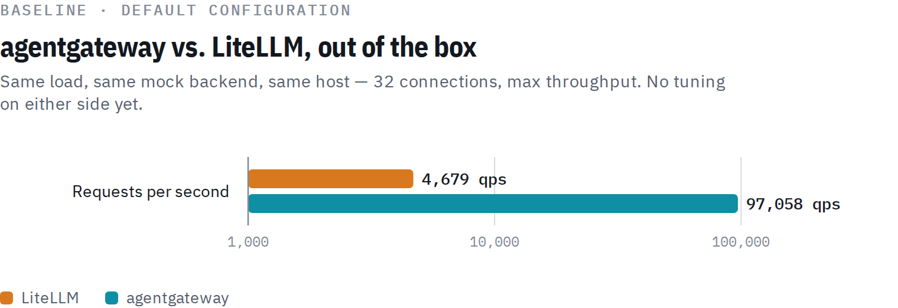
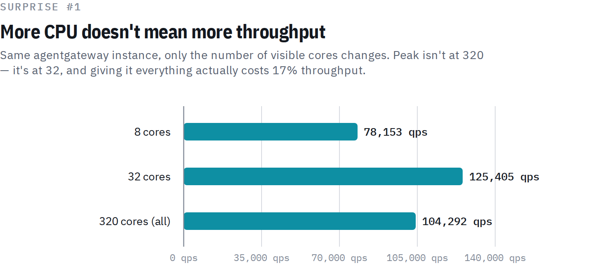
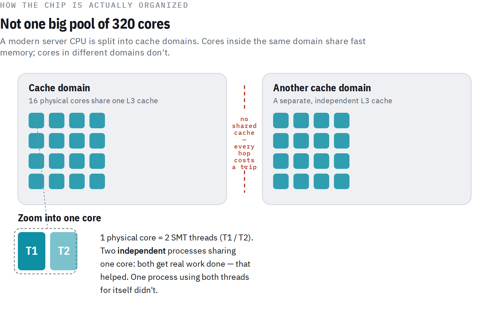
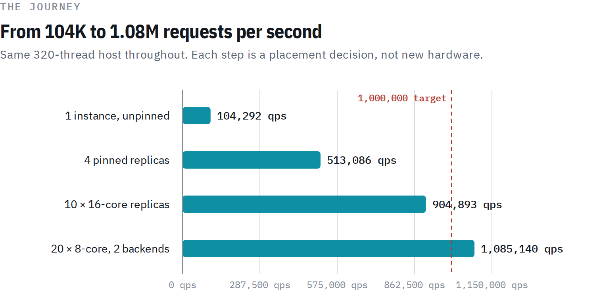

# benchmark-agentgateway-on-amd-epyc

Configuration, scripts, and raw results behind
[*How agentgateway Reached 1.08M+ req/s (And Why 320 CPU Threads Were Slower
Than 32)*](https://medium.com/@fjvicens/how-agentgateway-reached-1-08m-req-s-and-why-320-cpu-threads-were-slower-than-32-6623154660be),
by Felipe Vicens.

This benchmark builds on [Lin Sun's `litellm-agw-perf`](https://github.com/linsun/litellm-agw-perf)
harness, which compares proxy overhead between agentgateway and LiteLLM. On
top of her default baseline, this repo pins agentgateway to specific CPU
cache domains, replicates it horizontally, and right-sizes each replica,
taking throughput on a 320-thread AMD EPYC 9845 from ~97,000 to over
**1,000,000 requests per second**.

## Results at a glance

| Step | Configuration | Throughput |
|---|---|---:|
| Baseline | agentgateway, default config | 97,058 qps |
| Baseline | LiteLLM, default config | 4,679 qps |
| Scaling 1/4 | One unpinned instance | 102,289 qps |
| Scaling 2/4 | Four cache-domain-pinned replicas | 434,343 qps |
| Scaling 3/4 | Ten right-sized replicas (16 cores each) | 724,290 qps |
| Scaling 4/4 | Twenty right-sized replicas (8 cores each, two backends) | **1,096,768 qps** |






## What's in this repo

```
results/
├── 01-baseline/          # LiteLLM vs. agentgateway, default configuration
├── 02-cpu-quota/         # --cpus 8 / 32 / unconstrained
├── 03-quota-vs-pinning/  # --cpus 32 vs --cpuset-cpus, same core budget
├── 04-replication/       # 4×32-core, 10×16-core, 20×8-core+2-backend replicas
└── 05-final-repeat/      # fully instrumented repeat of the winning 20-replica layout
```

Every folder contains real `fortio` JSON output and per-container
`docker stats`, captured directly from the runs described below.

## Source of the tests

The baseline harness — docker-compose, mock backend, payload generator, the
`fortio` wrapper — is [Lin Sun's `litellm-agw-perf`](https://github.com/linsun/litellm-agw-perf)
(Apache-2.0), used unmodified, which also inspired the [original
agentgateway vs. LiteLLM benchmark post](https://agentgateway.dev/blog/2026-08-13-benchmarking-agentgateway-vs-litellm-rust-mode/).
See "How to reproduce" below for how to get it.

The CPU-quota, pinning, and replication experiments go beyond what her repo
runs out of the box. The scripts in `scripts/` in this repo are original,
built on the same docker images and mock-server payload, launching
containers directly with `docker run` instead of `docker-compose` so each
one can be pinned to specific cores.

## Configuration used

- **Host**: AMD EPYC 9845, 160 physical cores / 320 threads (SMT2), 10 L3
  cache domains of 16 physical cores each.
- **Images**: `ghcr.io/agentgateway/agentgateway:v1.4.1`,
  `ghcr.io/berriai/litellm:main-latest`, `howardjohn/hyper-server:latest`
  (mock backend).
- **Payload**: a fixed 1,024-character OpenAI-style `chat.completions`
  request/response pair (~1.1 KB), HTTP/1.1, keep-alive on.
- **Load**: `fortio load`, max QPS, 320 total connections for the
  CPU-quota/pinning experiments, 480 total connections for the replication
  experiments (split evenly across replicas), 15–30 s per run.
- **agentgateway config** (`configs/agentgateway.yaml` in Lin Sun's repo,
  used unmodified):
  ```yaml
  config:
    adminAddr: 0.0.0.0:23500
    statsAddr: 0.0.0.0:23501
    readinessAddr: 0.0.0.0:23502
  llm:
    port: 4001
    models:
      - name: "openai/gpt-3.5-turbo"
        provider: openAI
        params:
          baseUrl: http://mock-server:8081/v1
          model: gpt-3.5-turbo
          apiKey: dummy
  ```
- **LiteLLM config** (`configs/litellm-config.yaml`, used unmodified):
  ```yaml
  model_list:
    - model_name: openai/gpt-3.5-turbo
      litellm_params:
        model: openai/dummy
        api_base: http://mock-server:8081/v1
        api_key: dummy
  ```

## How to reproduce

1. **Clone the baseline harness:**
   ```bash
   git clone https://github.com/linsun/litellm-agw-perf.git
   cd litellm-agw-perf
   ```
   `configs/agentgateway.yaml` and `configs/litellm-config.yaml` are already
   her repo's defaults — nothing needs to change for the OpenAI path used
   throughout this benchmark.

2. **Run the baseline** exactly as the harness ships it:
   ```bash
   PAYLOAD_SIZES=1024 ./scripts/run-benchmark.sh
   ```
   This produces `results/01-baseline/` — LiteLLM vs. agentgateway, default
   configuration, no pinning.

3. **Copy this repo's orchestration scripts** alongside the cloned harness:
   ```bash
   cp /path/to/benchmark-agentgateway-on-amd-epyc/scripts/*.sh .
   chmod +x run-cpu-quota.sh run-replication.sh run-instrumented-repeat.sh
   ```
   They reuse the harness's docker images and 1,024-char payload
   (`litellm-agw-perf/payloads/req-1024.json`).

4. **Run the CPU-quota, pinning, and replication experiments:**
   ```bash
   ./run-cpu-quota.sh cpus-8                 --cpus=8
   ./run-cpu-quota.sh cpus-32                --cpus=32
   ./run-cpu-quota.sh cpus-320-unconstrained  ""
   ./run-cpu-quota.sh cpuset-1domain-smt      --cpuset-cpus=0-15,160-175
   ./run-cpu-quota.sh cpuset-2domains-nosmt   --cpuset-cpus=0-31

   ./run-replication.sh 4-replicas-32cores            4  32 1
   ./run-replication.sh 10-replicas-16cores           10 16 1
   TOTAL_CONNECTIONS=480 ./run-replication.sh 20-replicas-8cores-2backends  20  8 2

   TOTAL_CONNECTIONS=480 ./run-instrumented-repeat.sh 30
   ```
   Each writes fortio JSON, per-replica summaries, and CPU/memory stats to
   `$HOME/agwbench-results/`.

## Results by experiment

### 1. Baseline — LiteLLM vs. agentgateway, default config

[`results/01-baseline/`](results/01-baseline) — 32 and 320 LiteLLM workers,
OpenAI and Anthropic/Rust paths, at both 32 and 320 fortio connections.

| Path | LiteLLM workers | fortio -c | LiteLLM qps | agentgateway qps |
|---|---:|---:|---:|---:|
| OpenAI | 32 | 32 | 4,679 | 97,058 |
| OpenAI | 320 | 32 | 5,068 | 95,448 |
| Anthropic/Rust | 32 | 32 | 5,789 | 91,894 |
| Anthropic/Rust | 320 | 32 | 5,904 | 102,614 |
| OpenAI | 32 | 320 | 4,282 | 104,036 |
| OpenAI | 320 | 320 | 11,857 | 102,890 |
| Anthropic/Rust | 32 | 320 | 6,277 | 98,490 |
| Anthropic/Rust | 320 | 320 | 11,723 | 98,098 |

agentgateway's p50/p99 on the headline OpenAI/32-workers run: 0.323 ms /
0.548 ms, against LiteLLM's 6.257 ms / 19.667 ms.

### 2. CPU-quota — cores made available vs. cores actually used

[`results/02-cpu-quota/`](results/02-cpu-quota) — single agentgateway
instance, single mock backend, 320-connection fortio load.

| Command | Throughput | p50 | p99 |
|---|---:|---:|---:|
| `docker run --cpus 8` | 80,261 qps | 3.625 ms | 16.795 ms |
| `docker run --cpus 32` | 129,020 qps | 0.473 ms | 52.280 ms |
| `docker run` (unconstrained, 320 visible) | 102,289 qps | 0.699 ms | 69.099 ms |

### 3. Quota vs. pinning

[`results/03-quota-vs-pinning/`](results/03-quota-vs-pinning) — the same
32-core budget, granted three different ways.

| Command | Throughput | p50 |
|---|---:|---:|
| `docker run --cpus 32` | 129,020 qps | 0.473 ms |
| `docker run --cpuset-cpus 0-15,160-175` (1 cache domain + SMT) | 132,126 qps | 0.289 ms |
| `docker run --cpuset-cpus 0-31` (2 cache domains, no SMT) | 138,436 qps | 0.329 ms |

### 4. Replicate, don't enlarge

[`results/04-replication/`](results/04-replication) — N independent,
cache-domain-pinned replicas, each with its own pinned `fortio` client.

| Configuration | Throughput |
|---|---:|
| 4 replicas × 32 cores (`--cpuset-cpus 0-31`/`32-63`/`64-95`/`96-127`) | 434,343 qps |
| 10 replicas × 16 cores (all 10 domains, no SMT) | 724,290 qps |
| 20 replicas × 8 cores, 2 independent backends | 1,096,768 qps |

### 5. Full instrumentation: the winning configuration, repeated

[`results/05-final-repeat/`](results/05-final-repeat) — the 20×8-core /
2-backend layout, sampled end to end: per-replica fortio JSON plus
`docker stats` at 1 Hz for the whole run.

**1,083,257 qps**, 0 timeouts, 32,498,157 successful requests with zero
non-200 responses across all 20 replicas. Per-replica p50 0.38–0.47 ms,
p99 0.85–1.70 ms. Backends at ~31% of their 32-core budget; replicas at
60–76% of their 8-core budget. Full per-second CPU/memory breakdown in
[`docker-stats-1hz.csv`](results/05-final-repeat/docker-stats-1hz.csv), full
per-replica latency in [`per-replica-summary.csv`](results/05-final-repeat/per-replica-summary.csv).
